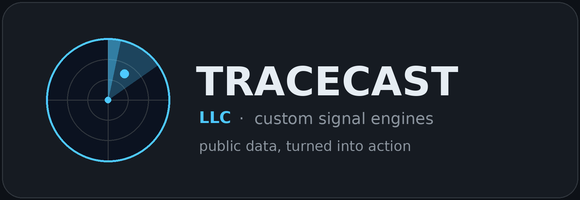

  

  
  
  
  

I build software that solves real problems, and I work on security in the lab. USAF veteran (F-15E armament, 335th FS), finishing a B.S. in IT, building B2B signal engines under **Tracecast LLC**.

## Things I've built

- **Azure SOC - Sentinel honeynet & attack map** - stood up a Windows honeypot on the public internet, forwarded its logs into a Microsoft Sentinel SIEM, hunted the attacks with KQL, and mapped global attacker origins.
  → [Azure-SOC-Sentinel-Lab](https://github.com/aahayeswgu/Azure-SOC-Sentinel-Lab)
- **MetroScan** - a B2B lead-signal engine: reads public data, finds businesses showing buying signals, scores and ranks them into a shortlist worth calling now. *(overview public, source private)*
  → [MetroScan](https://github.com/aahayeswgu/MetroScan)
- **Groundwork** - a map-first field-sales platform: prospecting, a pin CRM, route planning, and visit tracking in one place. *(overview public, source private)*
  → [Groundwork-Platform](https://github.com/aahayeswgu/Groundwork-Platform)
- **WatchTower** - open-source early warning that turns publicly advertised gatherings into lead time. Public data only. *(overview public, source private)*
  → [WatchTower-OSINT](https://github.com/aahayeswgu/WatchTower-OSINT)

## Working with

  
  
  
  
  
   
  
  
  
  
  
  

## By the numbers

  
  

### Also
B.S. in IT at WGU. Sharpening offensive security through hands-on labs.

### Contact
- 🌐 [tracecast.app](https://tracecast.app)
- 💼 [LinkedIn](https://www.linkedin.com/in/alan-hayeswgu)
- 📧 [aahayes95@gmail.com](mailto:aahayes95@gmail.com)

---

  

