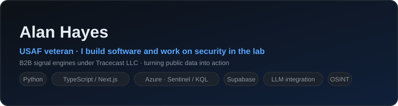

# Alan Hayes

USAF veteran. I build software that solves real problems, and I work on security in the lab.

### Things I've built
- **Azure SOC - Sentinel honeynet & attack map** - stood up a Windows honeypot on the
  public internet, forwarded its logs into a Microsoft Sentinel SIEM, hunted the attacks
  with KQL, and mapped global attacker origins.
  -> [azure-soc-sentinel-lab](https://github.com/aahayeswgu/azure-soc-sentinel-lab)
- **MetroScan** - a B2B lead-signal engine: discovers a market, detects buying-intent
  signals from public data, scores and ranks leads, and ships curated reports.
  *(overview public, source private)*
  -> [metroscan](https://github.com/aahayeswgu/metroscan)
- **Groundwork** - a field-sales platform for account managers: territory, leads, route
  planning, and visit tracking in one place. *(overview public, source private)*
  -> [groundwork-platform](https://github.com/aahayeswgu/groundwork-platform)
- **WatchTower** - an OSINT early-warning tool: finds publicly-advertised gatherings from
  open-source signals and writes them up as structured reports. Public data only.
  -> [watchtower-osint](https://github.com/aahayeswgu/watchtower-osint)

### Working with
Python - TypeScript / Next.js - Azure - Microsoft Sentinel / KQL - Supabase -
data pipelines - LLM integration

### Also
B.S. in IT at WGU. Building B2B signal engines under Tracecast LLC. Sharpening offensive
security through hands-on labs.

### Contact
- [tracecast.app](https://tracecast.app)
- [LinkedIn](https://www.linkedin.com/in/alan-hayeswgu)
- [aahayes95@gmail.com](mailto:aahayes95@gmail.com)
